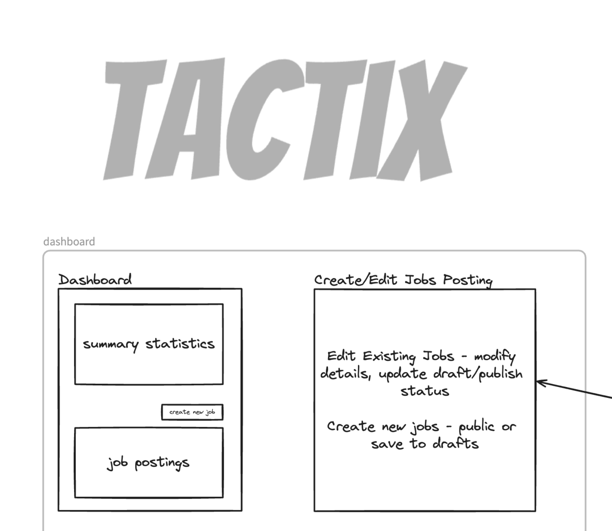

<h1 align="center">Tactix</h1>

<p align="center">Tactix is a hiring automation tool that helps you hire the best talent efficiently! With tactix, you can create job ads and get a short list of the top ranked candidates for each application.</p>

<h3 align="center">
  <b><a href="https://tactix-z2o.vercel.app">Get Started</a></b>
</h3>



## Features

- Create and manage job ads efficiently
- Publish jobs and receive applications
- Get a pre-ranked list of top applicants for each position

## Running the application

The best way to use the app is to try it out here, but if you want to self host or run locally, here are a couple of ways to do that:

### Local Machine with nodejs

1. Clone the repo:

```sh
> git clone git@github.com:lawalbolaji/gpt-playground.git
```

2. In the project's root directory, run:

```sh
> cp .env.example .env.local
```

3. Get OpenAI API Key [here](https://platform.openai.com/account/api-keys) and add those credentials to your `.env.local` file

4. Install NodeJs dependencies:

```sh
> npm ci
```

5. Boot up:

```sh
> npm run dev
```

## Contributing

- Missing something or found a bug? [Report here](https://github.com/lawalbolaji/tactix-z2o/issues).
- Pull requests are welcome but for major issues, please open an issue [here](https://github.com/lawalbolaji/tactix-z2o/issues) for discussion first.
